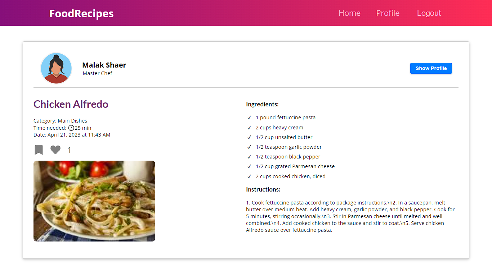

<div align="center">

> Hello world! This is the project’s summary that describes the project plain and simple, limited to the space available.

**[PROJECT PHILOSOPHY](https://github.com/julescript/well_app#-project-philosophy) • [TECH STACK](https://github.com/julescript/well_app#-tech-stack) • [IMPLEMENTATION](https://github.com/julescript/well_app#-impplementation) • [HOW TO RUN?](https://github.com/julescript/well_app#-how-to-run)**

</div>

<br><br>


> FoodRecipes is a platform for food lovers, where they can share their recipes, create, like, and save recipes, and connect with other food enthusiasts from around the world. With FoodRecipes, users can easily search for recipes, upload their own recipes, and interact with a community of passionate home cooks and professional chefs.

> FoodRecipes is designed to be user-friendly and intuitive, making it easy for anyone to get started with sharing and discovering new recipes. The platform features robust search functionality, allowing users to filter by name, ingredient, category and more. Users can create and edit their own recipe collections, save their favorite recipes, and like and share recipes with friends.

### User Stories

> As a user, I want to be able to create and share my favorite recipes with others, so that I can inspire and help others who are looking for new recipe ideas.

> As a user, I want to be able to like and save recipes that I find interesting or want to try later, so that I can easily access them at a later time.

> As a user, I want to be able to search for recipes based on different criteria such as category, ingredients, cooking time, etc., so that I can easily find recipes that fit my specific needs or preferences.

> As a user, I want to be able to connect and interact with other food enthusiasts, so that I can get notes, tips, and ideas from other like-minded individuals who share my passion for cooking and food.

<br><br>


Here's a brief overview of the tech stack this app uses:

- Frontend: This project uses the [Next.js](https://nextjs.org/docs). Next.js is an open-source web development framework created by the private company Vercel providing React-based web applications with server-side rendering and static website generation.

- Backend: The backend is implemented using [Gin](https://gin-gonic.com/docs/) which is a HTTP web framework written in Go (Golang)

- Database: For persistent storage, the app uses [MongoDB](https://www.mongodb.com/). MongoDB is a source-available cross-platform document-oriented database program. Classified as a NoSQL database program, MongoDB uses JSON-like documents with optional schemas

<br><br>


> Using the above mentioned tech stacks and user sorties we have, the implementation of the app is shown as below, these are screenshots from the project

| Login                               | Register                               |
| ----------------------------------- | -------------------------------------- |
|  |  |

| Home Screen                        | Search                                 |
| ---------------------------------- | -------------------------------------- |
|  |  |

| Recipe Details                          | User Profile                              |
| --------------------------------------- | ----------------------------------------- |
|  |  |

| Profile                               | Edit Profile                          |
| ------------------------------------- | ------------------------------------- |
|  |  |

| Create Recipe                          | Edit Recipe                          |
| -------------------------------------- | ------------------------------------ |
|  |  |

<br><br>


> This guide will walk you through the steps necessary to install and run the Food Recipes Project on your local machine. The project uses Next.js for the frontend, Gin for the backend, and MongoDB for the database.

### Prerequisites

- [Node.js](https://nodejs.org/en/)
- [Go](https://go.dev/doc/install)
- [MongoDB](https://www.mongodb.com/)

## Frontend Installation (Next.js)

1. Clone the repository

```sh
git clone https://github.com/malakshaer/food-recipes.git
```

2. Navigate to the frontend directory and install the dependencies.

```sh
cd frontend
npm install
```

3. Start the development server.

```sh
npm run dev
```

4. Open your browser and navigate to http://localhost:3000 to access the Food Recipes web application.

## Backend Installation (Gin)

1. Navigate to the backend directory and install the dependencies.

```sh
cd ../backend
go mod download
```

2. Start the server

```sh
go run main.go
```

## Database Installation (MongoDB)

1. Download and install MongoDB from the [official website]()

2. Start the MongoDB server

```sh
mongod
```

3. Create a new database called food-recipes

```sh
mongo
> use food-recipes
```

4. Create collections for the database.

```sh
mongo
> db.createCollection("recipes")
> db.createCollection("users")
```

5. Restart the backend server.

```sh
go run main.go
```
